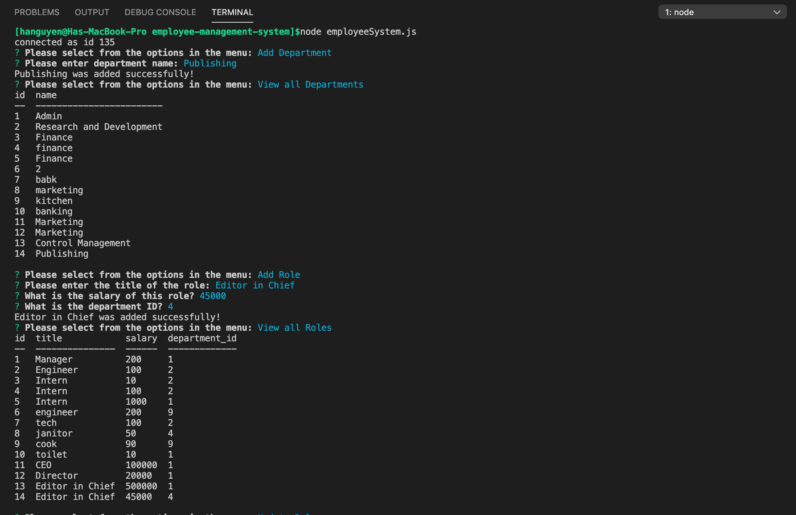
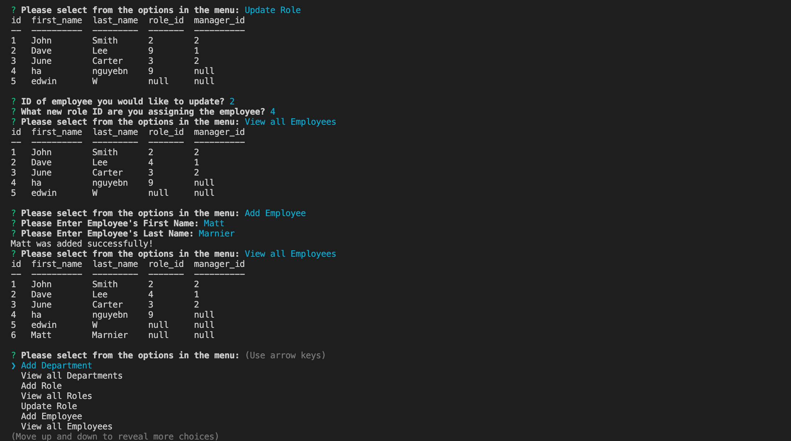

# About employee-management-system

This is a solution that helps a company's manage its employees, their roles, salaries using node, inquirer, and MySQL.

## Demonstration

## Description

This application was developed with Node.js and invoked with `node .js` command line. The application will prompt the user for information about the departments, employees and their responsibilities.  

## Installation: 
- Run `npm install`
- Run `dotevn`
- Run `mysql`
- Run `inquirer`

## Instructions

Create the database on MySQLWorkbench, then use the `Inquirer npm package` to prompt the user for the information on different departments, employees and roles. The application was developed with Node.js and invoked with `node index.js.` command line. It allows the user to Add departments, roles, employees | View departments, roles, employees | Update employee roles.

## Link to employee-management-system

https://github.com/iamha1/employee-management-system
